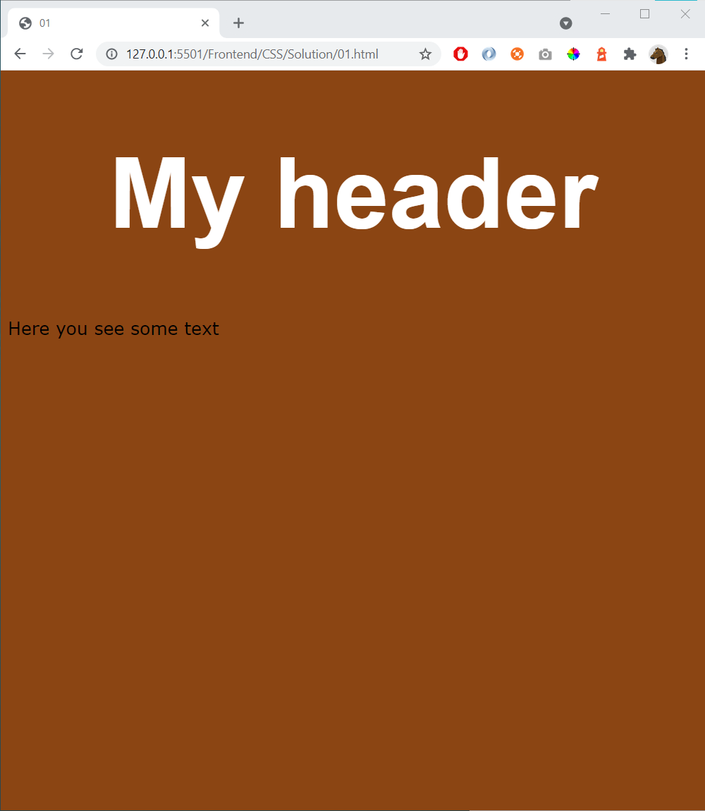

# 01 - Basics

References
- https://www.w3schools.com/css/default.asp
- https://www.w3schools.com/css/css_intro.asp
- https://www.w3schools.com/css/css_syntax.asp 

Start with this HTML 

    <!DOCTYPE html>
    <html lang="en">
    <head>
        <meta charset="UTF-8">
        <meta name="viewport" content="width=device-width, initial-scale=1.0">
        <title>01</title>
        
    </head>

    <body>

        <h1>My header</h1>
        
Here you see some text

    </body>

    </html>

Then add styling to create this page:

Hint: 
- color used: saddlebrown, white
- fonts used: Arial, Verdana
