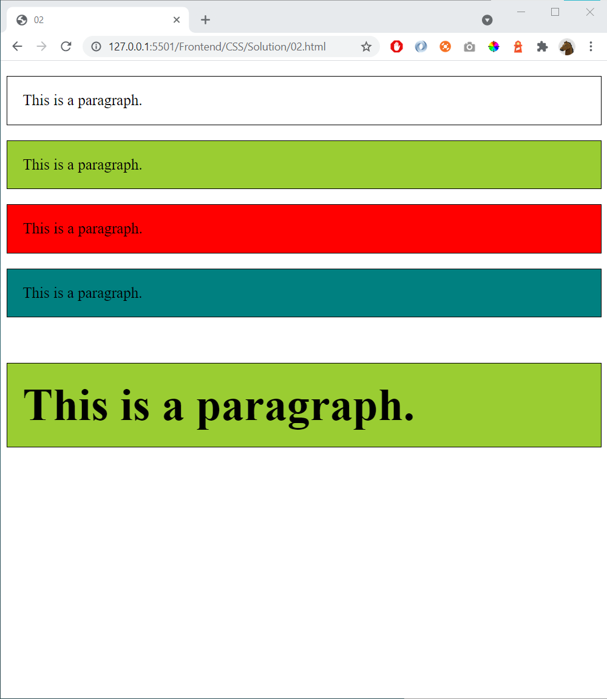

# 02 - Selectors and Comments

References
- https://www.w3schools.com/css/css_selectors.asp 
- https://www.w3schools.com/css/css_howto.asp
- https://www.w3schools.com/css/css_comments.asp

Start with this:

    <!DOCTYPE html>
    <html lang="en">
    <head>
        <meta charset="UTF-8">
        <meta name="viewport" content="width=device-width, initial-scale=1.0">
        <title>02</title>

        
    </head>

    <body>

        
This is a paragraph.

        
This is a paragraph.

        
This is a paragraph.

        
This is a paragraph.

        
This is a paragraph.

    </body>

    </html>

Create this page:

