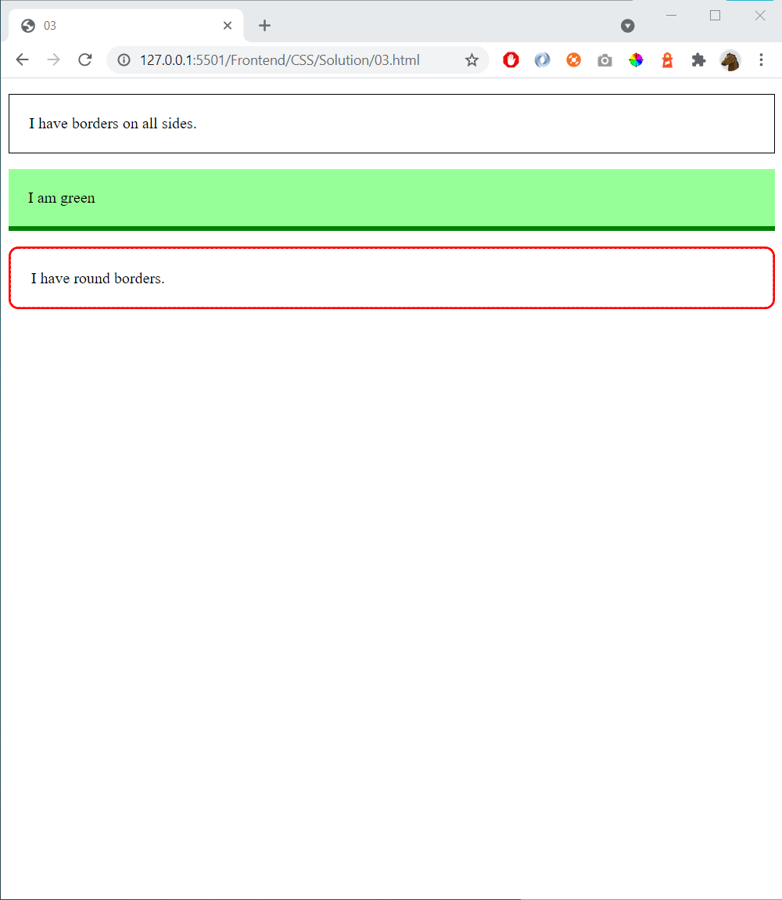

# 03 - Borders

References
- https://www.w3schools.com/css/css_border.asp

Start with this HTML (in the body-tag):

    
I have borders on all sides.

    
I am green

    
I have round borders.

Add styling-code to create this page:

