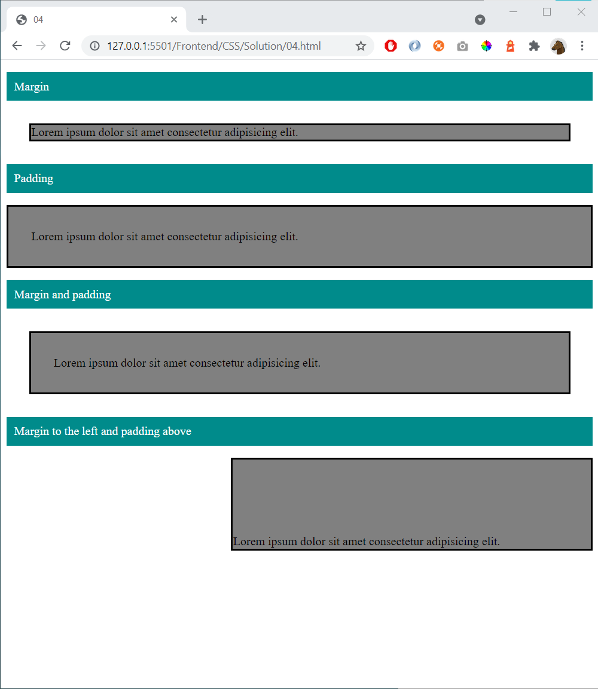

# 04 - Margin and Padding

References
- https://www.w3schools.com/css/css_margin.asp 
- https://www.w3schools.com/css/css_padding.asp
- https://www.w3schools.com/css/css_boxmodel.asp
- https://developer.mozilla.org/en-US/docs/Web/CSS/box-sizing

Start with this HTML

    
Margin

    
Lorem ipsum dolor sit amet consectetur adipisicing elit.

    
Padding

    
Lorem ipsum dolor sit amet consectetur adipisicing elit.

    
Margin and padding

    
Lorem ipsum dolor sit amet consectetur adipisicing elit.

    
Margin to the left and padding above

    
Lorem ipsum dolor sit amet consectetur adipisicing elit.

Add this styling:

        div {
            border: solid 3px;
            background: grey;
            margin: 0;
            padding: 0;
        }

Continue with the CSS and create this page:

