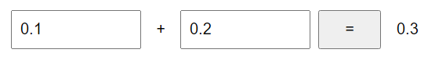
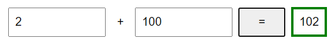
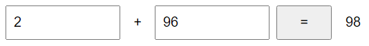
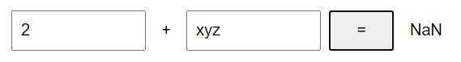

# Checkpoint - Frontend

## Time

2h

## General

Only hand in one file: **checkpoint.js**

Only hand in a solution that you think is correct

You are not allowed to change checkpoint.css or checkpoint.html. Do all your coding in checkpoint.js

Start solving Level 1 (since it's needed to pass Level 2)

## Get started

Download the files
- checkpoint.css
- checkpoint.html
- gnomes (a library)

...to a folder on your computer. Open the folder in Visual Studio Code.

## Level 1

If the user writes two numbers and then presses "=", show the sum of the number to the right:

If the sum is greater than 100, show a green frame around:

A smaller sum shouldn't give any border:

You don't need to care about validation:

Hint
- Use "parseFloat" to convert a string to a number
- Use the supplied function "round" to round the result (otherwise 0.1 + 0.2 won't be correct)

## Level 2

First solve Level 1

When the page loads, show all gnomes

After a key is pressed, only show gnomes that contain the search text. Here we search for all gnomes that have a description that contains **g**:

Search for **ga**

Search for **garden**

Search for **gardenz**

