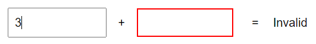
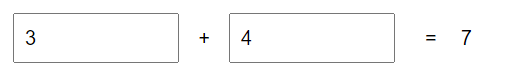
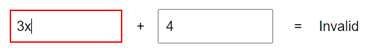
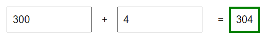

# Extra

Start with the files in the folder "StartKit"

Change the borders (and Invalid-text) as soon as the user changes any input.

Screenshots from the app:

 If the sum is greater than 100 show green border

