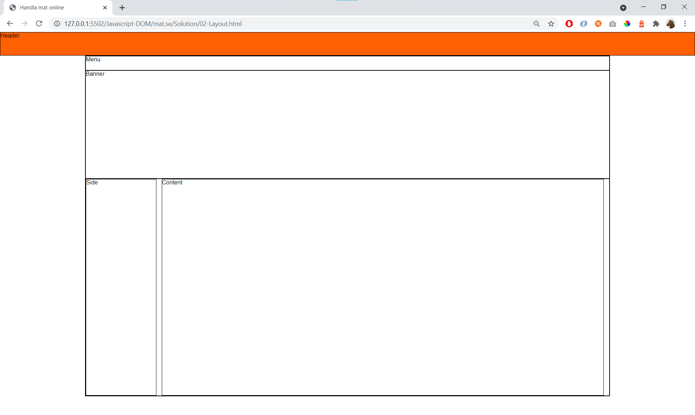

# 02 - Layout 

Create this page:

...and when the browser window is smaller than 800px:

Exercise in 30min. Finish **layout.css**. You'll start with

    02-Layout.html
    layout-start.css
    img (folder)

## Hint

CSS

    background
    height
    width
    display:none
    display:block

Media query

    @media (...) {}

https://www.w3schools.com/css/css_background.asp

https://www.w3schools.com/css/css_dimension.asp

https://www.w3schools.com/css/css_display_visibility.asp