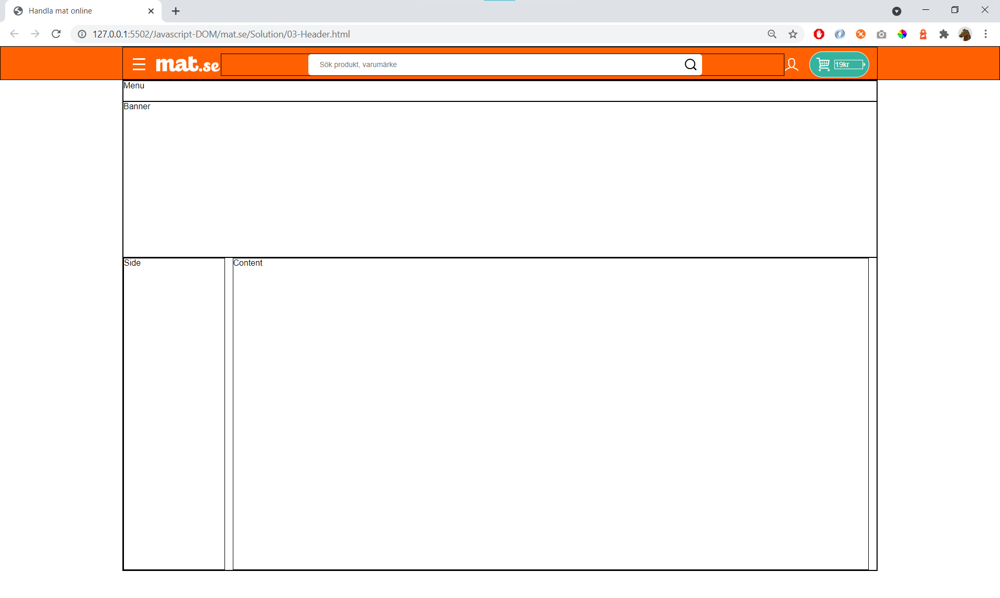
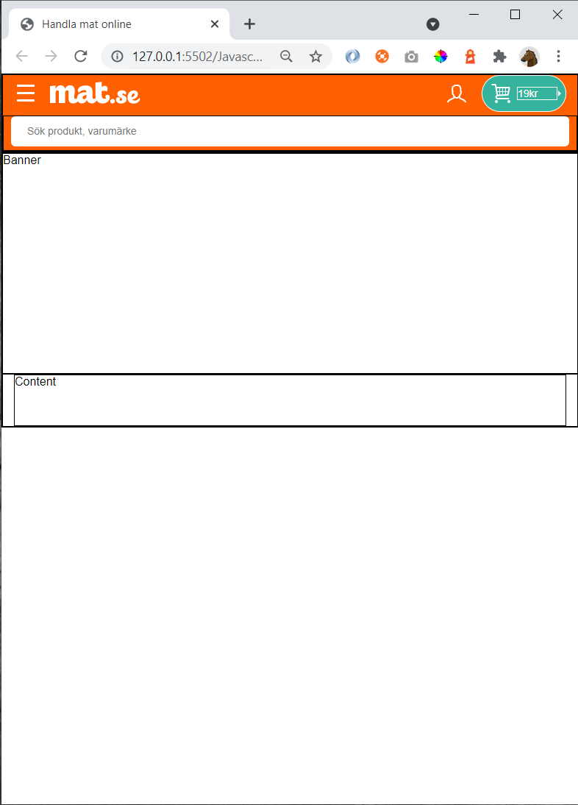

# 03 - Header 

Create this page:

...and in smaller window:

Teacher shows **03-Header.html** 

Exercise in 30 min. Finish **header.css**. You'll start with

    03-Header.html
    header-start.css

## Hint

General advice in Visual Studio Code: you can select two files (ctrl-click), right-click and do "Compare selected"

CSS

    background-color
    border-radius
    color
    cursor
    font-size
    height
    margin-left
    margin-right
    width

Flexbox

    display: flex;
    align-items

https://www.w3schools.com/css/

    