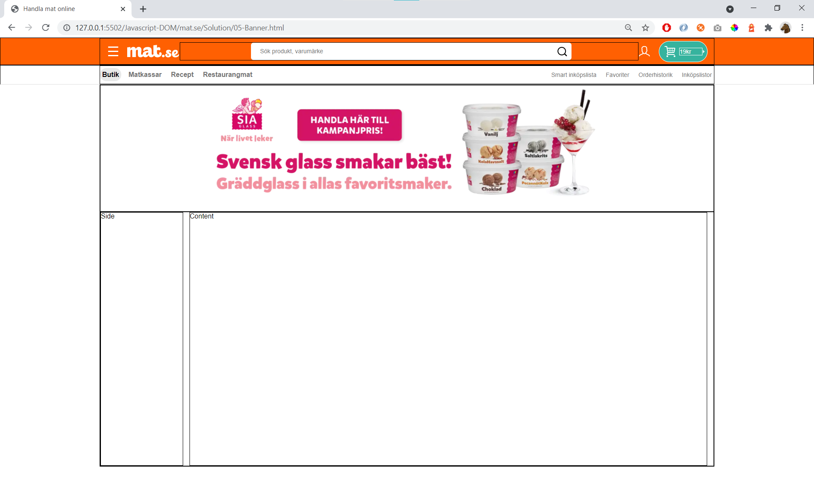
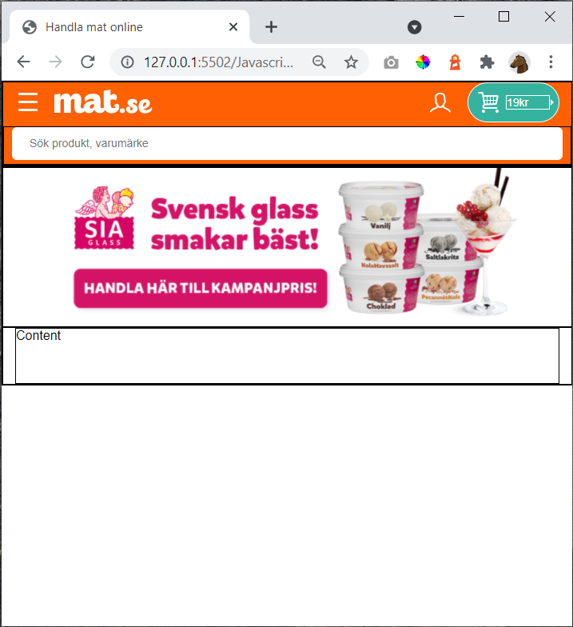

# 05 - Banner (30min)

Create this page:

...and in smaller window: (note that the image is swapped)

The image(s) should be centered

Exercise in 30 min. Finish **banner.css**

# Hint

CSS

    background-image
    background-position
    background-repeat
    background-size
    
